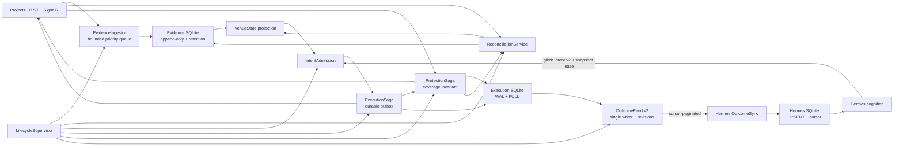
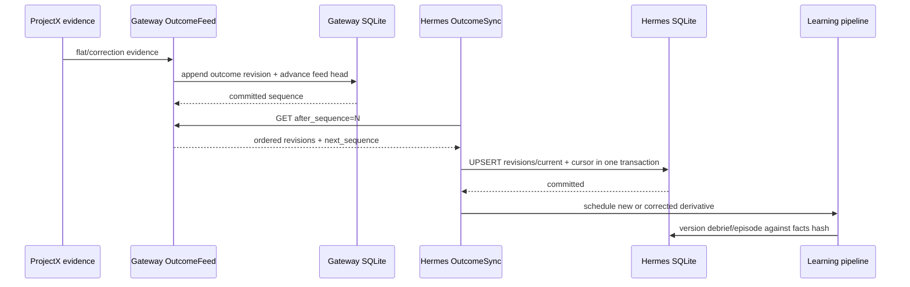
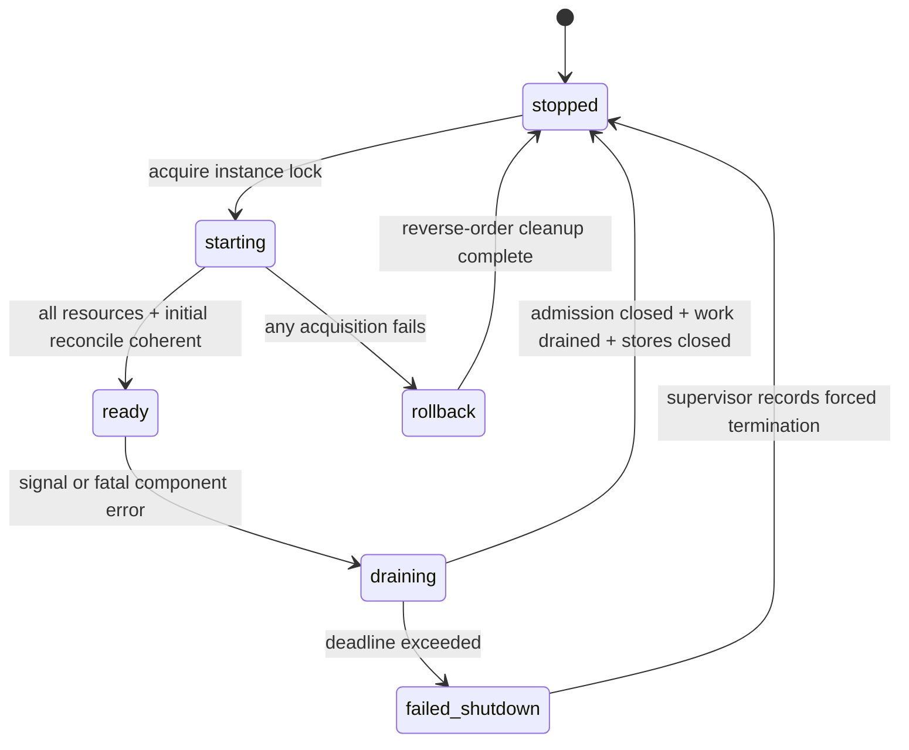
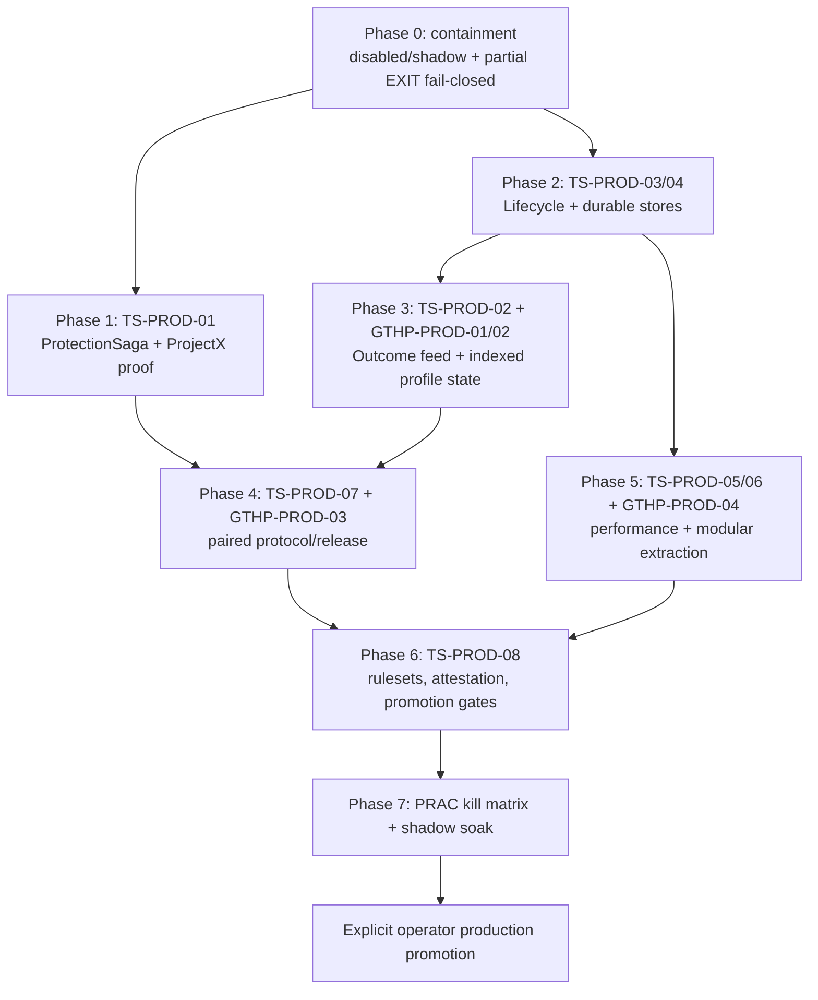

# Production hardening architecture

**Date:** 2026-08-18  
**Status:** proposed; production promotion blocked  
**Gateway audit baseline:** [`0588dc7bb3be66b5f6ce05cb05bf19da97116bc9`](https://github.com/GlitchTrader/glitch-topstep/commit/0588dc7bb3be66b5f6ce05cb05bf19da97116bc9)  
**Hermes profile audit baseline:** [`fcfe99be975307690453a69baa623a2f2e843bd0`](https://github.com/GlitchTrader/glitch-topstep-hermes-profile/commit/fcfe99be975307690453a69baa623a2f2e843bd0)  
**Authority:** `docs/ledger/ledger.json` plus the companion profile ledger  
**Audit method:** static code review, local build/test suites, dependency metadata, and repository governance inspection. No real ProjectX order was submitted by the audit.

## Decision

The paired gateway/profile system must remain `disabled` or `shadow` for unattended operation until the P0 production items in this document are closed with evidence. Passing unit tests is necessary but not sufficient: the release gate is proof that every process, provider, persistence, and delivery failure converges to a safe and attributable state.

The architecture keeps the existing authority boundary:

- Hermes owns probabilistic market judgment and trade intent.
- Glitch owns identity, provider truth, factual admission, execution, protection, reconciliation, receipts, and durable outcome publication.
- ProjectX is the venue authority for position, order, fill, and native order-group relationships.
- The human operator owns account, contract, mode, promotion, and break-glass authority.

This hardening work must not introduce a hidden trading strategy, trade quota, confidence gate, or automatic mutation that was not authorized by an operator or Hermes intent. It makes the execution of an authorized intent safe; it does not decide whether the trade is good.

## Target topology



### Boundary rule

Domain modules declare commands, events, states, invariants, and ports. ProjectX, SQLite, HTTP, filesystem, clock, and Hermes are adapters. A domain module may not reach through an adapter to infer an undocumented provider relationship.

## Global safety invariants

The following invariants are release blockers and should exist as executable assertions, metrics, and fault-injection properties:

1. **Protection coverage:** if `venue_open_quantity > 0`, `proven_stop_coverage >= venue_open_quantity`. A degraded state may omit TP; it may not omit stop coverage.
2. **No duplicate mutation:** one canonical intent body produces at most one economic provider mutation, including across timeout, retry, restart, and stream/REST disagreement.
3. **No unowned amendment:** a protective order is amended or cancelled only through an explicit, durable provider identity and generation owned by the current position/saga.
4. **Persist before apply:** provider evidence that changes execution truth is durable before it changes the in-memory projection.
5. **Single writer per truth:** gateway is sole authority for canonical outcomes; profile is sole authority for cognitive derivatives. JSONL exports are never shared mutable databases.
6. **Cursor with effect:** a consumer cursor advances in the same transaction that persists the corresponding effect.
7. **Fail closed for exposure, remain available for reduction:** uncertainty blocks new exposure but must preserve EXIT, recovery, reconciliation, and operator visibility when safely possible.
8. **One runtime owner:** only one process may own the configured account/contract mutation role at a time.
9. **No silent corruption:** malformed, lost, truncated, or skipped records produce a durable error and quarantine evidence.
10. **Artifact pair:** an armed runtime uses a tested gateway/profile pair identified by immutable SHAs, protocol revision, capability revisions, and hashes.

## 1. Protected reduction and native bracket safety

Tracked by [`TS-PROD-01`](https://github.com/GlitchTrader/glitch-topstep/issues/109), with provider evidence in [#67](https://github.com/GlitchTrader/glitch-topstep/issues/67).

### Immediate containment

Until ProjectX behavior is proven and the saga exists:

- remove partial EXIT and TP rearm from capabilities advertised in `armed`;
- reject partial EXIT with `partial_exit_requires_atomic_protection_transition`;
- retain full EXIT as a risk-reducing action;
- if only one protective leg can be proven, prefer stop-only and enter `degraded_stop_only`;
- block new exposure while protection or order-group ownership is ambiguous.

This containment is intentionally conservative. A take-profit is a strategy convenience; a stop is a survival control.

### Durable state machine

```mermaid
stateDiagram-v2
    [*] --> protected_active
    protected_active --> reduction_prepared: persist requested qty + current group
    reduction_prepared --> reduction_submitting: provider mutation begins
    reduction_submitting --> reduction_ambiguous: timeout or process loss
    reduction_submitting --> reduced_protected: reduction and replacement proven
    reduction_submitting --> flat: provider proves zero position
    reduction_ambiguous --> reduced_protected: reconcile proves reduced + covered
    reduction_ambiguous --> protected_active: reconcile proves original position + cover
    reduction_ambiguous --> degraded_stop_only: stop cover proven; TP absent/unknown
    reduced_protected --> protected_active: saga committed
    degraded_stop_only --> protected_active: native group later proven
    degraded_stop_only --> flat: authorized EXIT proves flat
    flat --> [*]
```



Every transition is committed with:

- saga ID and intent ID;
- account, contract, side, original quantity, requested reduction, observed quantity;
- protection generation;
- provider group/parent/child identities when supplied;
- proven stop and target coverage;
- command hash, provider attempt identity, result or ambiguity;
- last reconciliation evidence sequence;
- compensation decision and reason.

### Transition rules

| From | Operation | Required proof before commit | Failure behavior |
|---|---|---|---|
| `protected_active` | prepare reduction | current position and stop coverage are fresh and attributable | reject without mutation |
| `reduction_prepared` | submit native reduction/group replacement | durable outbox row | recover from outbox |
| `reduction_submitting` | accept completion | provider position and new stop coverage agree | otherwise `reduction_ambiguous` |
| `reduction_ambiguous` | reconcile | authoritative REST plus user events are stored | never retry economic mutation blindly |
| any positioned state | TP failure | full stop coverage remains proven | `degraded_stop_only`; alert and block entries |
| any state | position becomes flat | zero venue position is proven | immediate idempotent orphan sweep |

### Provider acceptance evidence

The ProjectX acceptance session must use a disposable PRAC account and at least two contracts so that a real partial close is possible. Capture sanitized envelopes/events for:

- initial bracket group and every explicit relation supplied by ProjectX;
- partial close of `N` from `M`;
- surviving order quantities and statuses;
- group behavior when TP fills and when SL fills;
- reused tags/group identifiers;
- REST state before and after stream ordering races;
- restart at every persisted saga state.

If ProjectX does not expose a usable native relation or atomic replacement primitive, partial EXIT remains unavailable in armed mode. Client-side timing is not atomicity.

## 2. Canonical outcome feed and learning integrity

Tracked by [`TS-PROD-02`](https://github.com/GlitchTrader/glitch-topstep/issues/110) and [`GTHP-PROD-01`](https://github.com/GlitchTrader/glitch-topstep-hermes-profile/issues/97).

### Ownership



The gateway no longer writes to the Hermes state directory. The profile no longer treats a shared JSONL file as authority. Both sides may export JSONL from SQLite for inspection, but exports are replaceable artifacts.

### Feed record

Minimum envelope:

```json
{
  "schema": "glitch.topstep.outcome_feed.v2",
  "sequence": 101,
  "outcome_id": "stable UUID",
  "intent_id": "entry intent UUID",
  "revision": 2,
  "status": "preliminary|final|corrected|voided",
  "content_hash": "sha256 canonical content",
  "supersedes_revision": 1,
  "published_utc": "RFC3339",
  "outcome": {}
}
```

The log is append-only by revision. A separate `outcomes_current` projection selects the highest valid revision. Corrections never mutate history in place.

### Consumer algorithm

1. Read the local cursor.
2. Request a bounded page after that sequence.
3. Validate schema, sequence continuity, content hash, outcome identity, and revision relationship.
4. In one transaction, insert the revision, update current projection, mark cognitive derivatives stale/versioned when facts changed, and advance the cursor.
5. Repeat while `has_more=true`.
6. On gap, hash mismatch, or cursor below retention floor, enter degraded learning state and require authenticated rebuild. Trading execution remains independent.

### Migration

- freeze the shared mirror;
- import the gateway JSONL as revision 1 with source hash and line number;
- import profile-only rows into a reconciliation table;
- emit counts for accepted, duplicate, conflicting, and quarantined rows;
- compare current projections before switching readers;
- keep the old files read-only for one rollback window;
- remove the mirror environment option after successful soak.

## 3. Transactional lifecycle and single-instance ownership

Tracked by [`TS-PROD-03`](https://github.com/GlitchTrader/glitch-topstep/issues/111).



Startup uses an acquisition stack. Each successful resource registers an idempotent disposer immediately. A late failure cancels the global token and disposes in reverse order. `service_ready` is written only after initial reconciliation, required stores, streams, timers, and HTTP are coherent.

Shutdown order:

1. reject new exposure admission;
2. cancel timers and new background work;
3. drain coordinator mutations and ambiguity records;
4. await reconcile, history, outcome publisher, and persistence queues;
5. close provider streams and HTTP;
6. checkpoint and close stores;
7. release instance lock;
8. write a terminal lifecycle summary.

The lock contains PID, process start time, account/contract scope, artifact hash, and heartbeat. Stale-lock recovery verifies process identity; PID reuse alone is not sufficient.

## 4. Durable stores and corruption policy

Tracked by [`TS-PROD-04`](https://github.com/GlitchTrader/glitch-topstep/issues/112) and [`GTHP-PROD-02`](https://github.com/GlitchTrader/glitch-topstep-hermes-profile/issues/98).

### Storage classes

| Data | Authority | Recommended store | Durability | Retention |
|---|---|---|---|---|
| intents, outbox, protection saga, receipts | gateway | SQLite WAL | `FULL` | no automatic deletion in execution path |
| provider evidence | gateway | separate SQLite WAL | measured policy; critical classes stronger than market bulk | bounded by class |
| outcome revisions/feed cursor | gateway | SQLite WAL | `FULL` | archive with retention floor protocol |
| cognition decisions, frames, outcome cursor, episodes | profile | SQLite WAL | `FULL` for identity/cursor | bounded/indexed; exports rotatable |
| JSONL | either | generated export only | not authoritative | rotate/rebuild |

Promise-based writers must recover their scheduling chain after a failed item. In-memory indexes are updated only after durable commit. Any remaining replace-file path uses temp file on the same volume, flush, fsync, atomic rename, and directory sync where the platform permits.

On startup:

- validate SQLite integrity and migration version;
- validate JSONL export tail if retained;
- truncate only a clearly incomplete final fragment;
- quarantine non-tail corruption rather than skipping it;
- expose the condition in health and operator events;
- block new exposure if execution identity or protection durability is uncertain.

## 5. Bounded evidence ingestion and backpressure

Tracked by [`TS-PROD-05`](https://github.com/GlitchTrader/glitch-topstep/issues/113).

The event loop must not perform one blocking SQLite transaction for every DOM callback. A dedicated persistence worker owns the evidence connection. Events cross a bounded channel and are applied to live state only after the worker acknowledges commit.

Priority and overload policy:

| Class | Examples | Overload behavior |
|---|---|---|
| P0 identity | position, order, user trade, lifecycle, reconcile | never drop; reserve capacity; degrade entries if backlog grows |
| P1 quote | best bid/ask | coalesce per contract/generation; retain previous and replacement hashes |
| P1 prints | market trades | bounded ordered batches; no reordering inside partition |
| P2 depth | DOM updates | batch or latest coherent snapshot per side/generation |

At high-water mark, the system marks evidence ingestion degraded, requests REST reconciliation, blocks new exposure, preserves identity/EXIT processing, and emits actionable metrics. Coalescing is a declared transformation with counts and source sequences, never a silent loss.

Required load proof uses at least multiples of the rates captured by TS-R2-07 and reports event-loop lag, queue age, commit latency, HTTP latency, reconnect heartbeat, reconcile time, memory, and disk growth.

## 6. Module boundaries

Tracked by [`TS-PROD-06`](https://github.com/GlitchTrader/glitch-topstep/issues/114) and [`GTHP-PROD-04`](https://github.com/GlitchTrader/glitch-topstep-hermes-profile/issues/100).

### Gateway modules

- `IntentAdmission`: request identity, schema, snapshot, current factual gates.
- `ExecutionSaga`: mutation outbox, ambiguity, recovery, terminal receipts.
- `ProtectionSaga`: coverage, order groups, protected reduction, orphan cleanup.
- `ReconciliationService`: convergence of REST and stream evidence.
- `EvidenceIngestor`: persistence queue, ordering, coalescing, projection ACK.
- `OutcomeFeed`: revisions, current projection, pagination, retention floor.
- `LifecycleSupervisor`: composition, acquisition rollback, draining, instance lock.

### Profile modules

- `gateway_client`: authenticated transport, retry, schema contract.
- `state_store`: SQLite, migrations, locks, cursors, indexed reads.
- `packet_projection`: pure sanitization and prompt-size projection.
- `cognition_cycle`: prompt assembly and model invocation.
- `intent_delivery`: frozen wire, idempotent delivery, receipt reconciliation.
- `outcome_sync`: cursor feed and revision handling.
- `learning_pipeline`: facts, debriefs, episodes, revisions.
- `scheduler`: cron/wake lifecycle without trading semantics.

Extraction is incremental: characterize, introduce ports, move one state machine, run parity tests, remove old path. No big-bang rewrite and no generic microservice framework.

## 7. Paired protocol and immutable release

Tracked by [`TS-PROD-07`](https://github.com/GlitchTrader/glitch-topstep/issues/115) and [`GTHP-PROD-03`](https://github.com/GlitchTrader/glitch-topstep-hermes-profile/issues/99).

The gateway health and profile distribution manifest must intersect on:

- protocol revision;
- gateway/profile semantic version ranges;
- exact artifact Git SHAs and hashes;
- decision packet schemas;
- intent schema;
- accepted prompt versions;
- outcome feed revision;
- capability revisions and safety evidence IDs;
- provider acceptance claims such as `native_oco_relation_proven`;
- migration floor/ceiling.

A boolean capability is insufficient for a behavior whose semantics changed. Armed mutation fails closed on an incompatible pair. Shadow/read-only inspection may continue and must report the precise mismatch.

CI builds an immutable pair by SHA, runs shared JSON fixtures and cross-repo smoke tests, and produces a pair manifest. Rollback selects a previously proven pair, not independently “latest” gateway and profile versions.

## 8. Repository and supply-chain governance

Tracked by [`TS-PROD-08`](https://github.com/GlitchTrader/glitch-topstep/issues/116).

Required before production:

- protected `main` rulesets in both repositories;
- PR, review, resolved conversations, current branch, and named checks required;
- force-push/deletion disabled;
- narrow audited break-glass;
- CODEOWNERS for execution/protection, release, and profile doctrine;
- workflow permissions minimal and actions pinned by commit SHA;
- deterministic dependency installation (`npm ci` and Python lock/manifest policy);
- secret scanning, dependency scanning, SAST/CodeQL;
- SBOM, checksums, provenance/attestation;
- manual promotion gate for `armed`, independent from deploy;
- immutable evidence attached to the ledger.

## Observability and SLOs

Thresholds should be derived from measured PRAC/shadow baselines, but the signal set is not optional.

| Area | Required signals | Production reaction |
|---|---|---|
| protection | open qty, proven stop coverage, saga state/age, orphan count | page operator; block entries; keep reduction path |
| lifecycle | process owner, phase, resource/drain counts, failed disposer | prevent second owner; supervised restart |
| evidence | queue depth/age, commit latency, event-loop lag, coalescing | degrade entries; reconcile |
| outcomes | feed head, retention floor, consumer cursor/lag, gaps, revisions | degrade learning; rebuild before trusting new lessons |
| persistence | last commit, backlog, disk free, integrity result, quarantine count | block entries when execution truth uncertain |
| provider | REST/stream generation, reconcile age, ambiguous mutations | fail closed for exposure; continue recovery |
| release | pair SHA/hash, protocol revision, capability proofs | refuse armed mismatch |

Every alert needs an owner, severity, first diagnostic query, safe operator action, escalation, and recovery proof. Logs alone are not an alerting system.

## Verification strategy

### Test layers

1. Pure transition/property tests for each state machine.
2. SQLite crash/restart and migration tests.
3. Adapter contract tests against sanitized ProjectX fixtures.
4. Deterministic fault injection at every durable boundary.
5. Cross-repo protocol and outcome replay tests.
6. Burst/load/soak tests with event-loop and disk measurements.
7. Operator-approved PRAC mutation acceptance.
8. Shadow soak with production-like supervisor and alerts.

### Minimum fault matrix

| Fault | Required assertion |
|---|---|
| crash before provider call | no mutation; safe replay |
| timeout during provider call | ambiguity persisted; no blind retry |
| crash after provider ACK before local receipt | reconcile recovers one mutation |
| failure between protective legs | stop coverage remains; TP may degrade |
| stream flat before REST | immediate orphan sweep; outcome waits for attributable proof |
| REST flat before stream | converge without duplicate exit/outcome |
| SQLite busy/disk full/permission loss | visible degraded state; no poisoned queue |
| corrupt JSONL legacy row | quarantine and deterministic migration report |
| shutdown during active work | drain or durable resumable state |
| outcome backlog > page limit | complete cursor replay |
| outcome correction after debrief | revisioned derivative, no stale silent learning |
| second process starts | lock denial before intent admission |
| incompatible artifact pair | armed mutation refused with explicit mismatch |

## Delivery phases and dependency order



Parallelism is safe only where state ownership does not overlap. In particular, do not implement the profile outcome consumer before the feed contract is frozen, and do not advertise partial EXIT before the provider acceptance proof is attached.

## Issue register

### Gateway

- [#109 TS-PROD-01](https://github.com/GlitchTrader/glitch-topstep/issues/109) — protected reduction and bracket rearm.
- [#110 TS-PROD-02](https://github.com/GlitchTrader/glitch-topstep/issues/110) — single-writer revisioned outcome feed.
- [#111 TS-PROD-03](https://github.com/GlitchTrader/glitch-topstep/issues/111) — transactional lifecycle and drain.
- [#112 TS-PROD-04](https://github.com/GlitchTrader/glitch-topstep/issues/112) — durable/recoverable writers.
- [#113 TS-PROD-05](https://github.com/GlitchTrader/glitch-topstep/issues/113) — evidence backpressure.
- [#114 TS-PROD-06](https://github.com/GlitchTrader/glitch-topstep/issues/114) — module/state-machine extraction.
- [#115 TS-PROD-07](https://github.com/GlitchTrader/glitch-topstep/issues/115) — paired protocol contract.
- [#116 TS-PROD-08](https://github.com/GlitchTrader/glitch-topstep/issues/116) — branch/release/supply-chain gates.

### Hermes profile

- [#97 GTHP-PROD-01](https://github.com/GlitchTrader/glitch-topstep-hermes-profile/issues/97) — revisioned outcome consumer.
- [#98 GTHP-PROD-02](https://github.com/GlitchTrader/glitch-topstep-hermes-profile/issues/98) — indexed durable state.
- [#99 GTHP-PROD-03](https://github.com/GlitchTrader/glitch-topstep-hermes-profile/issues/99) — hermetic tests and reproducible release CI.
- [#100 GTHP-PROD-04](https://github.com/GlitchTrader/glitch-topstep-hermes-profile/issues/100) — worker decomposition.

## Production promotion checklist

- [ ] TS-PROD-01, TS-PROD-02, TS-PROD-03, TS-PROD-08 and GTHP-PROD-01 closed with immutable evidence.
- [ ] No advertised capability lacks a provider acceptance evidence ID.
- [ ] Kill matrix demonstrates no duplicate mutation and no uncovered positioned state.
- [ ] Outcome replay and correction tests demonstrate no lost/stale learning input.
- [ ] Single-instance, startup rollback, shutdown drain, disk-full and corruption drills pass.
- [ ] Cross-repo pair manifest, SBOM, hashes and attestation verify.
- [ ] Required GitHub rulesets/checks are active and bypass tested.
- [ ] Shadow soak meets defined SLOs without unresolved protection/outcome/persistence alerts.
- [ ] PRAC acceptance uses the exact release pair proposed for promotion.
- [ ] Human operator records explicit account, contract, mode, artifact pair, rollback pair, and promotion time.

## Stop lines

- Do not infer OCO or order ownership from geometry, timing, price, or quantity proximity.
- Do not hide uncertainty by treating missing evidence as optional.
- Do not let learning or observability failure create an unauthorized trade decision.
- Do not fix event-loop blocking by weakening execution-state durability.
- Do not perform a big-bang rewrite of coordinator, service, parity, or cycle workers.
- Do not promote from green unit tests alone.
- Do not write directly to unprotected `main`; merge this documentation and subsequent implementation through reviewable PRs.


